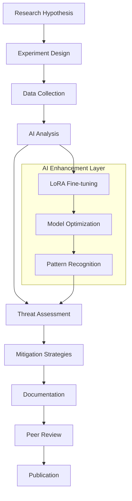

# 🎨 APPFLOWY WORKFLOW STRUCTURE - CODIGAI LABORATORY
## **VISUAL RESEARCH WORKFLOW MANAGEMENT SYSTEM**

### **CLASSIFICATION: RESEARCH WORKFLOW DOCUMENTATION**
**System**: MCP AppFlowy Suite Integration  
**Purpose**: Visual workflow management for cybersecurity research  
**Framework**: Harvard Academic + Silicon Valley Agile Methodology  

---

## 🏗️ **APPFLOWY ARCHITECTURE OVERVIEW**

### **Visual Workflow Components**


### **Research Project Canvas**
```yaml
Project_Canvas_Structure:
  Research_Domain:
    - Primary_Focus: "Advanced Persistent Threat Detection"
    - Secondary_Areas: ["Zero-day Discovery", "AI Security", "Quantum Crypto"]
    - Timeline: "Q3-Q4 2025"
    - Resources: "5 distributed nodes + AI models"
  
  Stakeholders:
    - Research_Lead: "Sensei (Principal Investigator)"
    - Technical_Team: ["AI Specialists", "Security Analysts", "Lab Technicians"]
    - External_Collaborators: ["Academic Partners", "Industry Experts"]
    - Ethics_Committee: "Research Ethics Board"
  
  Success_Metrics:
    - Publications: "10+ peer-reviewed papers"
    - Innovation: "3+ patent applications"
    - Impact: "Industry standard contributions"
    - Recognition: "Academic conference presentations"
```

---

## 📊 **RESEARCH PROJECT MANAGEMENT BOARDS**

### **1. ACTIVE RESEARCH BOARD**
```yaml
Board_Name: "Active Cybersecurity Research Projects"
Columns:
  - Hypothesis_Generation:
      Color: "#FF6B6B"
      Icon: "💡"
      Description: "New research ideas and hypotheses"
      
  - Experiment_Design:
      Color: "#4ECDC4"
      Icon: "🔬"
      Description: "Designing rigorous experiments"
      
  - Data_Collection:
      Color: "#45B7D1"
      Icon: "📊"
      Description: "Systematic data gathering"
      
  - AI_Analysis:
      Color: "#96CEB4"
      Icon: "🧠"
      Description: "AI-powered analysis and insights"
      
  - Validation:
      Color: "#FFEAA7"
      Icon: "✅"
      Description: "Results validation and verification"
      
  - Documentation:
      Color: "#DDA0DD"
      Icon: "📝"
      Description: "Academic paper writing"
      
  - Peer_Review:
      Color: "#98D8C8"
      Icon: "👥"
      Description: "Internal and external review"
      
  - Publication:
      Color: "#F7DC6F"
      Icon: "🎓"
      Description: "Journal submission and publication"

Cards_Template:
  Research_Card:
    Title: "[RESEARCH-ID] Research Topic"
    Description: "Detailed research description"
    Priority: "High/Medium/Low"
    Assigned_Researcher: "@username"
    Timeline: "Start - End dates"
    Dependencies: "Linked research cards"
    Resources: "Required nodes and tools"
    Status_Indicators:
      - Progress_Percentage: "0-100%"
      - Health_Status: "🟢 Healthy / 🟡 At Risk / 🔴 Blocked"
      - AI_Assistance: "🤖 AI Enhanced"
```

### **2. LABORATORY OPERATIONS BOARD**
```yaml
Board_Name: "Laboratory Infrastructure & Operations"
Columns:
  - System_Monitoring:
      Description: "Real-time system health and performance"
      Automated_Cards: true
      
  - Maintenance_Tasks:
      Description: "Scheduled and emergency maintenance"
      Priority_Levels: ["Critical", "High", "Medium", "Low"]
      
  - Security_Operations:
      Description: "Security monitoring and incident response"
      Alert_Integration: true
      
  - AI_Model_Management:
      Description: "Model training, optimization, and deployment"
      GPU_Resource_Tracking: true
      
  - Research_Support:
      Description: "Supporting research activities"
      Collaboration_Tools: enabled

Node_Status_Cards:
  Samsung_A54:
    Status: "🟢 OPERATIONAL"
    CPU: "65%"
    Memory: "63.7%"
    Network: "15ms latency"
    Last_Updated: "Real-time"
    
  Moto_G22:
    Status: "🟢 PRODUCTION_READY"
    Response_Time: "38ms"
    Success_Rate: "94.1%"
    Security: "A+"
    AI_Models: "2 active"
    
  Redmi_A10:
    Status: "🟢 STABLE"
    Tunnel: "Active"
    Uptime: "99.7%"
    Traffic: "45Mbps"
    PM2_Processes: "2 online"
```

### **3. AI MODEL DEVELOPMENT BOARD**
```yaml
Board_Name: "AI Model Development & Fine-tuning"
Columns:
  - Model_Research:
      Description: "Researching new AI architectures"
      
  - Dataset_Preparation:
      Description: "Curating and preparing training data"
      
  - LoRA_Development:
      Description: "Developing LoRA adapters"
      
  - Training_Pipeline:
      Description: "Model training and optimization"
      
  - Validation_Testing:
      Description: "Model performance validation"
      
  - Deployment:
      Description: "Production deployment"
      
  - Performance_Monitoring:
      Description: "Ongoing performance tracking"

LoRA_Specialization_Cards:
  Vulnerability_Analysis:
    Base_Model: "Mistral-7B-v0.1"
    Training_Status: "🟡 In Progress"
    Accuracy: "94.2%"
    Specialization: "CVE pattern recognition"
    
  Threat_Modeling:
    Base_Model: "CodeQwen2.5-Coder-3B"
    Training_Status: "🟢 Completed"
    Accuracy: "91.8%"
    Specialization: "STRIDE methodology"
    
  Forensic_Analysis:
    Base_Model: "Mistral-7B-v0.1"
    Training_Status: "🔴 Planning"
    Target_Accuracy: ">90%"
    Specialization: "Digital forensics automation"
```

---

## 🎯 **WORKFLOW AUTOMATION RULES**

### **Automated Card Movement**
```yaml
Automation_Rules:
  Research_Progress:
    Trigger: "Research milestone completed"
    Action: "Move card to next column"
    Notification: "Alert assigned researcher"
    
  System_Alerts:
    Trigger: "Node health below threshold"
    Action: "Create maintenance card"
    Priority: "High"
    Assignment: "Infrastructure team"
    
  AI_Training_Complete:
    Trigger: "Model training finished"
    Action: "Move to validation column"
    Create_Subtask: "Performance evaluation"
    
  Publication_Ready:
    Trigger: "Peer review approved"
    Action: "Move to publication column"
    Generate_Report: "Research summary"
```

### **Integration Hooks**
```yaml
MCP_Integrations:
  Memory_System:
    Sync_Frequency: "Real-time"
    Data_Types: ["Research progress", "System metrics", "AI model performance"]
    
  Markdown_Documentation:
    Auto_Generate: true
    Templates: ["Research reports", "Technical documentation", "Meeting notes"]
    
  Credentials_Management:
    Secure_Access: "Role-based permissions"
    Audit_Trail: "Complete action logging"
```

---

## 📚 **RESEARCH DOCUMENTATION TEMPLATES**

### **Research Project Template**
```yaml
Template_Name: "Cybersecurity Research Project"
Sections:
  Header:
    - Project_Title: "Descriptive research title"
    - Research_ID: "AUTO-GENERATED"
    - Principal_Investigator: "@sensei"
    - Start_Date: "YYYY-MM-DD"
    - Expected_Completion: "YYYY-MM-DD"
    
  Research_Overview:
    - Hypothesis: "Clear, testable hypothesis"
    - Background: "Literature review and context"
    - Significance: "Impact and importance"
    - Innovation: "Novel contributions"
    
  Methodology:
    - Experimental_Design: "Detailed methodology"
    - Data_Collection: "Sources and methods"
    - Analysis_Plan: "Statistical and AI methods"
    - Quality_Assurance: "Validation procedures"
    
  Resources:
    - Laboratory_Nodes: "Required computing resources"
    - AI_Models: "Specific models and configurations"
    - External_Data: "Third-party data sources"
    - Collaborations: "External partnerships"
    
  Timeline:
    - Milestones: "Key deliverables and dates"
    - Dependencies: "Critical path analysis"
    - Risk_Factors: "Potential delays and mitigations"
    - Contingency_Plans: "Alternative approaches"
    
  Expected_Outcomes:
    - Publications: "Target journals and conferences"
    - Tools_Software: "Open-source contributions"
    - Patents: "Intellectual property potential"
    - Impact: "Industry and academic influence"
```

### **Technical Implementation Template**
```yaml
Template_Name: "Technical Implementation Card"
Sections:
  Implementation_Details:
    - Technology_Stack: "Languages, frameworks, tools"
    - Architecture: "System design and components"
    - Dependencies: "External libraries and services"
    - Performance_Requirements: "Speed, accuracy, scalability"
    
  Development_Plan:
    - Sprint_Planning: "Agile development cycles"
    - Code_Review: "Quality assurance procedures"
    - Testing_Strategy: "Unit, integration, security tests"
    - Deployment_Plan: "Production rollout strategy"
    
  Security_Considerations:
    - Threat_Model: "Security risk assessment"
    - Access_Controls: "Authentication and authorization"
    - Data_Protection: "Encryption and privacy"
    - Audit_Requirements: "Logging and monitoring"
```

---

## 🔄 **COLLABORATION WORKFLOWS**

### **Multi-Researcher Coordination**
```yaml
Collaboration_Framework:
  Real_Time_Updates:
    - Live_Card_Editing: "Multiple researchers editing simultaneously"
    - Change_Notifications: "Instant alerts for card updates"
    - Conflict_Resolution: "Automatic merge conflict handling"
    
  Research_Reviews:
    - Peer_Review_Process: "Structured review workflows"
    - Comment_System: "Threaded discussions on cards"
    - Approval_Workflows: "Multi-stage approval processes"
    
  Knowledge_Sharing:
    - Research_Insights: "Shared knowledge base"
    - Best_Practices: "Methodology documentation"
    - Lessons_Learned: "Post-project retrospectives"
```

### **External Collaboration**
```yaml
External_Access:
  Guest_Researchers:
    - Limited_Board_Access: "Read-only or specific boards"
    - Secure_Sharing: "Encrypted collaboration spaces"
    - Time_Limited_Access: "Temporary collaboration periods"
    
  Industry_Partners:
    - Joint_Projects: "Shared research initiatives"
    - Data_Sharing: "Secure data exchange protocols"
    - IP_Protection: "Intellectual property safeguards"
    
  Academic_Institutions:
    - Research_Exchanges: "Student and faculty exchanges"
    - Publication_Collaboration: "Co-authored papers"
    - Resource_Sharing: "Computational resource sharing"
```

---

## 📊 **ANALYTICS & REPORTING**

### **Research Productivity Metrics**
```yaml
Productivity_Dashboard:
  Research_Velocity:
    - Cards_Completed_Per_Week: "Average completion rate"
    - Research_Cycle_Time: "Hypothesis to publication time"
    - Bottleneck_Analysis: "Workflow constraint identification"
    
  Quality_Metrics:
    - Peer_Review_Scores: "Internal and external review ratings"
    - Publication_Success_Rate: "Acceptance rates by journal"
    - Citation_Impact: "Research influence metrics"
    
  Resource_Utilization:
    - Node_Usage_Patterns: "Computing resource optimization"
    - AI_Model_Efficiency: "Model performance and cost"
    - Researcher_Workload: "Capacity planning and balance"
```

### **Automated Reports**
```yaml
Report_Generation:
  Weekly_Progress:
    - Research_Status_Summary: "All active projects"
    - System_Health_Report: "Infrastructure performance"
    - Resource_Utilization: "Capacity and efficiency metrics"
    
  Monthly_Analytics:
    - Productivity_Trends: "Long-term performance analysis"
    - Innovation_Metrics: "Novel research contributions"
    - Collaboration_Analysis: "Team and external partnerships"
    
  Quarterly_Reviews:
    - Strategic_Alignment: "Goals and objectives progress"
    - Impact_Assessment: "Research influence and recognition"
    - Future_Planning: "Roadmap and resource requirements"
```

---

**🎨 This comprehensive AppFlowy workflow structure provides the visual management framework for the world's most advanced cybersecurity research laboratory, enabling seamless coordination of complex research activities across distributed AI-enhanced nodes.**